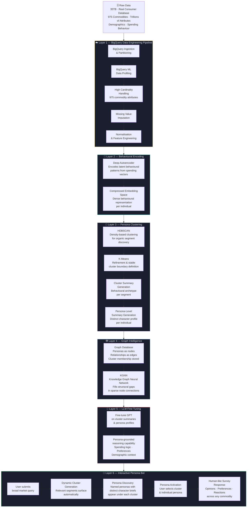

# 🧬 Digital Twin for Market Survey
### AI Flagship — Synthetic Persona Generation & Behavioural Intelligence Platform

> Transforms 35TB of real consumer behavioural data into living digital twins — AI personas that think, reason, and respond like real humans across 975 commodity categories, eliminating the cost and time of traditional market surveys.


> 🔒 **This is a private repository.** Source code is not publicly accessible. This README documents the system architecture, methodology, and business impact.

---

## 📌 Overview

Traditional market surveys are expensive, slow, geographically limited, and subject to human bias. For a market research company managing one of the world's largest consumer behavioural databases — **35TB of real demographic and spending data across 975 commodity categories** — a fundamentally different approach was needed.

The Digital Twin Platform generates **synthetic AI personas** that are statistically and behaviourally indistinguishable from real consumer segments. Each digital twin is grounded in real spending patterns, demographic profiles, and commodity preferences — and can be queried interactively to simulate human opinions, product reactions, and market responses at scale.

This replaces costly human surveys with on-demand, always-available, demographically precise synthetic respondents.

---

## 💼 Business Problem

| Challenge | Impact |
|---|---|
| Market surveys are expensive and slow | High cost per insight, long turnaround |
| Limited geographic and demographic reach | Biased or incomplete respondent pools |
| 35TB database unusable in raw form | No actionable intelligence extractable at scale |
| 975 commodity categories with trillions of attributes | Extreme high cardinality, missing values, noise |
| No way to simulate consumer reactions pre-launch | Products tested only after costly production |
| Survey fatigue among real respondents | Declining response rates and quality |

---

## ✅ What the Platform Does

- **Cleans and encodes** 35TB of real consumer behavioural data via BigQuery pipelines
- **Learns** latent behavioural patterns using a deep Autoencoder
- **Segments** consumers into distinct behavioural clusters via HDBSCAN and K-Means
- **Stores** personas and their relationships in a Graph Database with KGNN gap-filling
- **Fine-tunes** an LLM on cluster and persona-level summaries for human-like reasoning
- **Serves** an interactive chatbot where users query personas dynamically and receive human-like survey responses across any commodity category

---

## 🏗️ End-to-End System Architecture



---

## 🧱 Technical Stack

| Layer | Technology |
|---|---|
| **Data Pipeline** | Google BigQuery, BigQuery ML |
| **Data Scale** | 35TB, trillions of attributes, 975 commodity categories |
| **Encoding** | Deep Autoencoder (TensorFlow / PyTorch) |
| **Clustering** | HDBSCAN, K-Means |
| **Dimensionality** | TF-IDF, PCA for high-cardinality reduction |
| **Graph Storage** | Neo4j / Graph Database |
| **Graph Intelligence** | KGNN (Knowledge Graph Neural Network) |
| **LLM** | Fine-tuned GPT (persona-grounded reasoning) |
| **RAG** | Vector retrieval over persona and cluster summaries |
| **Embeddings** | Sentence-Transformers |
| **Bot Interface** | Streamlit / FastAPI |
| **Deployment** | GCP / On-premise |

---

## 🎯 Layer-by-Layer Deep Dive

### ☁️ Layer 1 — BigQuery Data Engineering Pipeline
The raw 35TB database contained real consumer profiles across demographics (age, gender, occupation, city, religion) and 975 commodity categories spanning groceries, medicines, luxury goods, holidays, charity, and more. The pipeline handled:
- **High cardinality** — 975 commodity attributes required TF-IDF vectorisation and dimensionality reduction before any ML workload
- **Missing value imputation** — demographic and behavioural gaps filled using statistical and ML-based strategies
- **Feature engineering** — spending ratios, category affinities, and demographic interaction features computed at scale via BigQuery ML

### 🧠 Layer 2 — Behavioural Encoding (Autoencoder)
A deep Autoencoder was trained to compress the high-dimensional spending behaviour vectors into dense latent embeddings. The encoder learns which combinations of commodity preferences, spending frequencies, and demographic signals define a person's behavioural identity — reducing trillions of attributes into compact, cluster-ready representations.

### 👥 Layer 3 — Persona Clustering
- **HDBSCAN** was applied first for density-based organic segment discovery — identifying natural groupings without forcing a fixed cluster count
- **K-Means** refined and stabilised cluster boundaries for consistent persona assignment
- Each cluster received a **behavioural archetype summary** (e.g., *"Urban millennial, high luxury affinity, low charity spend, health-conscious grocery buyer"*)
- Each individual within a cluster received a **persona-level character brief** with a name and distinct personality anchored in their actual spending data

### 🕸️ Layer 4 — Graph Intelligence
All personas and their cluster memberships were stored in a **Graph Database** as nodes and edges, capturing relationships between demographically and behaviourally similar individuals. Where the graph had **sparse or missing connections** — individuals who didn't fit cleanly into clusters — a **Knowledge Graph Neural Network (KGNN)** was used to infer and fill structural gaps, ensuring no persona was left unconnected.

### 🤖 Layer 5 — LLM Fine-Tuning
A GPT model was fine-tuned on the full corpus of cluster summaries and individual persona profiles. This grounds the LLM in real consumer logic — enabling it to reason from a persona's perspective, simulate spending decisions, and generate contextually accurate opinions across any commodity category rather than producing generic responses.

### 💬 Layer 6 — Interactive Persona Bot
The front-end experience:
1. User submits a broad market research query (e.g., *"How do people feel about premium organic groceries?"*)
2. The system **dynamically generates relevant clusters** matching the query context
3. Under each cluster, **named personas with distinct character briefs** appear
4. User selects a cluster and an individual persona
5. The activated persona responds **like a real human** — with opinions, preferences, hesitations, and reasoning shaped entirely by their actual behavioural data

---

## 💡 Example Interaction

```
User Query:
"How would different consumer segments react to a ₹2,500/month
 premium organic grocery subscription?"

→ Cluster A: Urban Health Optimisers
   └── Priya, 34, Mumbai, Software Engineer
       "I already spend around ₹4,000 on organic produce monthly.
        A curated subscription at ₹2,500 makes sense if the sourcing
        is certified. I'd want flexible cancellation though."

→ Cluster B: Budget-Conscious Families
   └── Ramesh, 47, Pune, Schoolteacher
       "₹2,500 is a lot for groceries. We buy local and seasonal.
        Unless there's a clear health benefit for my kids, I wouldn't
        switch from our regular sabzi vendor."

→ Cluster C: Retired Conservative Spenders
   └── Meena, 63, Chennai, Retired
       "I don't trust these online subscriptions. My daughter uses
        one but I prefer to see and pick my vegetables myself."
```

---

## 📊 Business Impact

| KPI | Result |
|---|---|
| Survey Cost | **Dramatically reduced — no human respondents needed** |
| Survey Turnaround Time | **Days → Minutes** |
| Demographic Coverage | **975 commodity categories across all segments** |
| Respondent Availability | **24/7 on-demand** |
| Geographic Reach | **Unlimited — no field operations required** |
| Insight Depth | **Individual persona-level granularity** |
| Scalability | **Millions of synthetic respondents generated from 35TB base** |

---

## 🔑 Key Differentiators

- **35TB real behavioural foundation** — digital twins grounded in actual consumer data, not synthetic generation from scratch
- **975 commodity categories** — broadest possible market coverage across all spending verticals
- **Autoencoder + HDBSCAN + K-Means pipeline** — multi-stage approach captures both organic and stable segmentation
- **KGNN gap-filling** — no persona left without a graph context, even outliers are intelligently connected
- **Persona-grounded LLM** — fine-tuned on real behavioural summaries, not generic prompting
- **Dynamic cluster discovery** — clusters surface contextually per query, not statically pre-defined
- **Human-like interactive personas** — named, characterful, and behaviourally precise respondents

---

## 🔒 Privacy & IP Notice

This repository contains proprietary source code, data pipelines, and AI models developed for a market research enterprise. All consumer data used in training was handled in compliance with applicable data privacy regulations. The code, models, and persona architecture are **not publicly accessible**.

If you are a recruiter, collaborator, or evaluator and would like a walkthrough or demo, please reach out:

📧 [paularpitaseis@gmail.com](mailto:paularpitaseis@gmail.com)
🔗 [LinkedIn — Arpita Paul](https://www.linkedin.com/in/dr-arpita-paul-575708135/)

---

## 👩‍💻 Author

**Arpita Paul** · Senior Data Scientist · GenAI & LLM Specialist
*From Seismology to GenAI 🚀 | NuSummit | Mumbai*

[](https://github.com/ArpitaAI-collab)
[](https://linkedin.com/in/yourprofile)
